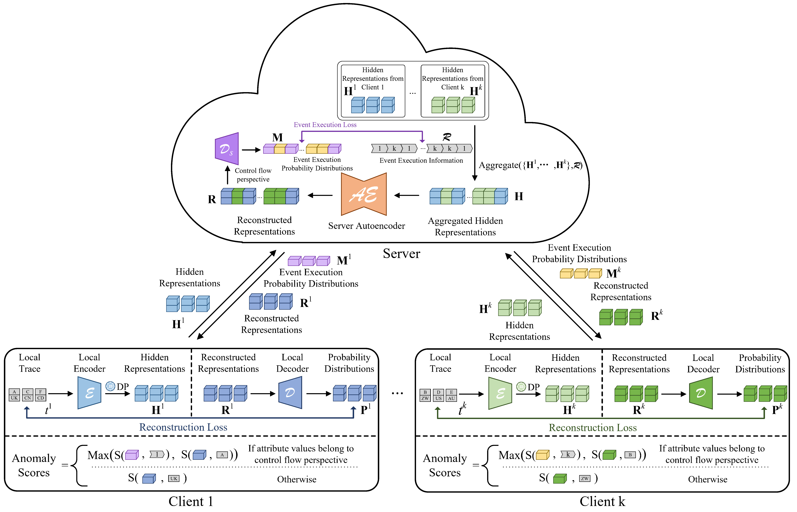
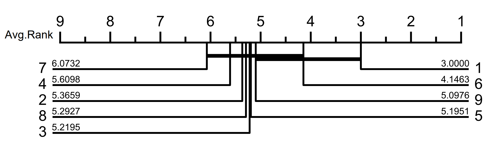
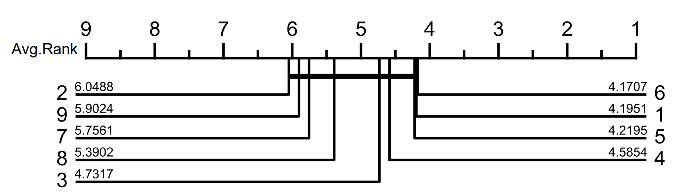

# DUAL: A Federated Unsupervised Anomaly Detection Framework for Cross-Enterprise Processes

This is the source code of our paper '**DUAL: A Federated Unsupervised Anomaly Detection Framework for Cross-Enterprise
Processes**'.

## Requirements

- Python==3.7
- [PyTorch==1.13.0](https://pytorch.org)
- [NumPy==1.21.5](https://numpy.org)
- [scikit-learn==1.0.2](https://scikit-learn.org)
- [pandas==1.3.5](https://pandas.pydata.org/)

## Datasets

Four commonly used real-life datasets:

i) **_[BPIC12](https://doi.org/10.4121/uuid:3926db30-f712-4394-aebc-75976070e91f)_**: Event log of a loan application
process

ii) **_[BPIC17](https://doi.org/10.4121/uuid:5f3067df-f10b-45da-b98b-86ae4c7a310b)_**: This event log pertains to a loan
application process of a Dutch financial institute. The data
contains all applications filed through an online system in 2016 and their subsequent events until February 1st 2017,
15:11.

iii) **_[BPIC20](https://doi.org/10.4121/uuid:52fb97d4-4588-43c9-9d04-3604d4613b51)_**: The dataset contains events
pertaining to two years of travel expense claims. In 2017, events were
collected for two departments, in 2018 for the entire university.

iv) **_[Receipt](https://doi.org/10.4121/12709127.v2)_**: This log contains records of the receiving phase of the
building permit application process in an
anonymous municipality.

Eight synthetic logs: i.e., **_Paper_**,  _**P2P**_, **_Small_**, **_Medium_**, **_Large_**, **_Huge_**, **_Gigantic_**,
and **_Wide_**.

The summary of statistics for each event log is presented below:

|    Log     | #Activities | #Traces |   #Events   | Max trace length | Min trace length | #Attributes | #Attribute values |
|:----------:|:-----------:|:-------:|:-----------:|:----------------:|:----------------:|:-----------:|:-----------------:|
|  Gigantic  |    76-78    |  5000   | 28243-31989 |        11        |        3         |     1-4     |      70-363       |
|    Huge    |     54      |  5000   | 36377-42999 |        11        |        5         |     1-4     |      69-340       |
|   Large    |     42      |  5000   | 51099-56850 |        12        |        10        |     1-4     |      68-292       |
|   Medium   |     32      |  5000   | 28416-31372 |        8         |        3         |     1-4     |      66-276       |
|    P2P     |     13      |  5000   | 37941-42634 |        11        |        7         |     1-4     |      39-146       |
|   Paper    |     14      |  5000   | 49839-54390 |        12        |        9         |     1-4     |      36-128       |
|   Small    |     20      |  5000   | 42845-46060 |        10        |        7         |     1-4     |      39-144       |
|    Wide    |    23-34    |  5000   | 29128-31228 |        7         |       5-6        |     1-4     |      53-264       |
|   BPIC12   |     36      |  13087  |   262200    |       175        |        3         |      0      |         0         |
|   BPIC17   |     26      |  31509  |   1202267   |       180        |        10        |      1      |        149        |
| BPIC20\_D  |     17      |  10500  |    56437    |        24        |        1         |      2      |         9         |
| BPIC20\_I  |     34      |  6449   |    72151    |        27        |        3         |      2      |        10         |
| BPIC20\_PE |     51      |  7065   |    86581    |        90        |        3         |      2      |        10         |
| BPIC20\_PR |     29      |  2099   |    18246    |        21        |        1         |      2      |        10         |
| BPIC20\_R  |     19      |  6886   |    36796    |        20        |        1         |      2      |        10         |
|  Receipt   |     27      |  1434   |    8577     |        25        |        1         |      2      |        58         |

Logs containing 10% artificial anomalies are stored in the folder '**_eventlogs_**'. The file names are formatted as
_log_name_-_anomaly_ratio_-_ID_.

## Running the Evaluation

- Revise <code>conf.py</code> in the root directory to configure settings such as the hyperparameters of the
  transformer-based autoencoder, the number of participating clients, and the level of Gaussian noise.
- Run <code>main.py</code> from the root directory to get the result for each dataset in the folder '**_eventlogs_**'.
- The results will be stored in 'result.csv'

## Experiment Results

### Overall Results

- Average precision (_AP_) over synthetic logs where 'T' and 'A'  represent trace- and attribute-level anomaly detection respectively:

|   Methods   |   Paper   |   Paper   |    P2P    |    P2P    |   Small   |   Small   |  Medium   |  Medium   |   Large   |   Large   |   Huge    |   Huge    | Gigantic  | Gigantic  |   Wide    |   Wide    |
|:-----------:|:---------:|:---------:|:---------:|:---------:|:---------:|:---------:|:---------:|:---------:|:---------:|:---------:|:---------:|:---------:|:---------:|:---------:|:---------:|:---------:|
|             |     T     |     A     |     T     |     A     |     T     |     A     |     T     |     A     |     T     |     A     |     T     |     A     |     T     |     A     |     T     |     A     |
| Centralized | **0.994** |   0.633   | **0.994** |   0.671   | **0.997** |   0.693   | **0.951** |   0.619   | **0.979** |   0.643   | **0.980** |   0.634   | **0.905** | **0.591** | **0.982** |   0.635   |
|    Plain    |   0.748   |   0.394   |   0.666   |   0.394   |   0.664   |   0.403   |   0.625   |   0.355   |   0.685   |   0.367   |   0.616   |   0.342   |   0.571   |   0.325   |   0.622   |   0.373   |
|   DUAL/DP   |   0.987   |   0.673   |   0.991   |   0.705   |   0.991   |   0.704   |   0.942   |   0.617   |   0.951   |   0.634   |   0.932   |   0.630   |   0.887   |   0.568   |   0.966   |   0.662   |
|    DUAL     |   0.974   | **0.674** |   0.979   | **0.714** |   0.977   | **0.708** |   0.932   | **0.642** |   0.929   | **0.655** |   0.905   | **0.638** |   0.869   |   0.578   |   0.953   | **0.692** |

- Average precision (_AP_) over real-life logs where 'T' and 'A' represent trace- and attribute-level anomaly detection respectively.

|   Methods   |  BPIC12   |  BPIC12   |  BPIC17   |  BPIC17   | BPIC20\_D | BPIC20\_D | BPIC20\_I | BPIC20\_I | BPIC20\_PE | BPIC20\_PE | BPIC20\_PR | BPIC20\_PR | BPIC20\_R | BPIC20\_R |  Receipt  |  Receipt  |    
|:-----------:|:---------:|:---------:|:---------:|:---------:|:---------:|:---------:|:---------:|:---------:|:----------:|:----------:|:----------:|:----------:|:---------:|:---------:|:---------:|:---------:|
|             |     T     |     A     |     T     |     A     |     T     |     A     |     T     |     A     |     T      |     A      |     T      |     A      |     T     |     A     |     T     |     A     |
| Centralized |   0.804   |   0.468   | **0.777** | **0.483** |   0.412   |   0.172   | **0.867** | **0.528** | **0.735**  | **0.461**  | **0.747**  | **0.564**  |   0.577   |   0.272   | **0.682** | **0.451** |
|    Plain    |   0.438   |   0.182   |   0.468   |   0.185   |   0.341   |   0.132   |   0.649   |   0.392   |   0.601    |   0.346    |   0.595    |   0.334    |   0.442   |   0.252   |   0.499   |   0.252   |
|   DUAL/DP   |   0.800   |   0.462   |   0.666   |   0.350   |   0.615   |   0.263   |   0.839   |   0.524   |   0.717    |   0.442    |   0.661    |   0.409    |   0.783   |   0.439   |   0.556   |   0.333   |
|    DUAL     | **0.824** | **0.473** |   0.528   |   0.267   | **0.904** | **0.517** |   0.739   |   0.483   |   0.668    |   0.452    |   0.609    |   0.383    | **0.916** | **0.579** |   0.513   |   0.288   |

### Extensibility of DUAL

We assess the extensibility of our DUAL framework by examining whether the number of clients affects anomaly detection
performance.

- Critical difference diagram over trace-level anomaly detection:
  

- Critical difference diagram over attribute-level anomaly detection:
  

The experimental results indicate that there is no significant difference in the performance of DUAL across different
numbers of clients, and the performance of DUAL with any number of clients shows no significant difference compared to
centralized training.

